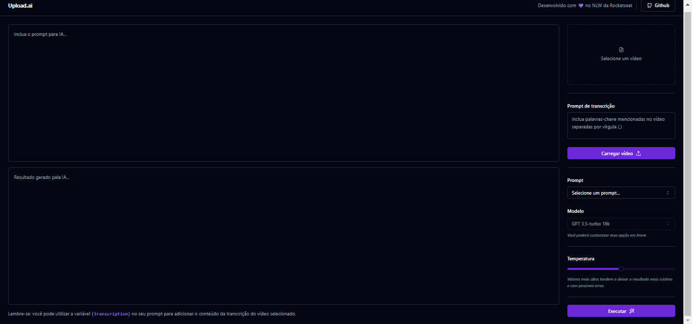
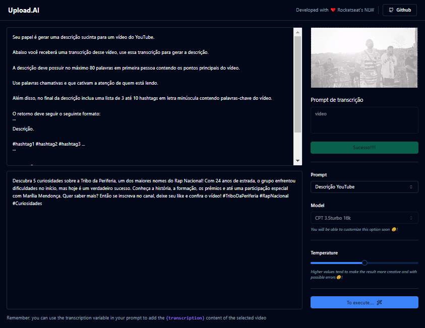

## Nlw_IA_Back_End
At Mastery we developed upload.ai with the Rocketseat team, a video upload tool for YouTube that automatically creates titles, descriptions and video materials.

<p align="center">
  <a href="#project">Project</a>&nbsp;&nbsp;&nbsp;|&nbsp;&nbsp;&nbsp;
  <a href="#technologies">Technologies</a>&nbsp;&nbsp;&nbsp;|&nbsp;&nbsp;&nbsp;
  <a href="#usage">Usage</a>&nbsp;&nbsp;&nbsp;|&nbsp;&nbsp;&nbsp;
  <a href="#about">About the project</a>&nbsp;&nbsp;&nbsp;|&nbsp;&nbsp;&nbsp;
  <a href="#license">License</a>
</p>

<p align="center">
  
</p>

<h3 id="project">📁 Project</h3>


    The project consists of a generator of descriptions and titles for YouTube
         videos based on content transcription.

    The project's front-end is available in this GitHub repository. The front-end is 
      now available [here](https://github.com/ludiemert/Nlw_IA_Web_Front).


 ## 1 - Project interface
 
 
## 2 - Project interface
 
 

<h3 id="technologies">💻 Technologies</h3>

  This project was developed using technologies:

- Node.js
- TypeScript
- Fastify
- Prisma
- Dotenv
- OpenAI
- Zod

- <h3 id="usage">💡 Usage</h3>

    To run the application on your machine locally, make sure you have `Node.js`
       and `pnpm` installed before proceeding with the steps below:

1. Clone the project:

```
$ git clone https://github.com/ludiemert/Nlw_IA_Back_End
```

2. Access the project folder:

```
$ cd Nlw_IA_Back_End
```

3. Install dependencies:

```
$ pnpm install
```

4. Execute as migrações:

```
$ npx prisma migrate dev
```

5. Start the server:

```
$ npm run dev
```

⚠️ **Important**: Create an .env file according to the .env.example file. 
  In the DATABASE_URL field, specify the URL of the database you want to use.
  Create an account on the [OpenAI](https://openai.com/) website, 
  get your API key and fill in the OPENAI_KEY field with your key.

- <h3 id="about">💻 About the project </h3>


      At the Rocketseat NLW event, with a special edition focused on
        Artificial Intelligence (AI).
      A project was developed using the OpenAI API, which involves uploading a video
            for the API to transcribe into text. 
      It generates coherent titles and descriptions based on the content of the
            uploaded video.

      For front-end development, React.js, Tailwind.css, Shadcn for stylized
            components and Web Assembly were used. Web Assembly 
            is a technology that allows us to run things on the web that are not
            traditionally web-based, among other technologies.

      On the back-end, Node.js was used, along with Fastify to handle API requests
            and routes, and Prisma as the database ORM, among other technologies.


#### 📝 Licença

     This project is under the MIT license. See the [LICENSE](LICENSE) file for more details.

---


 ### ✒️ Authors
 * **Rocketseat**

- ### My LinkedIn - [](https://www.linkedin.com/in/lucianadiemert/)


### Contact


### [**Luciana Diemert**](https://github.com/ludiemert)

🛠 `Junior Web Developer | HTML | CSS | JavaScript | ReactJS | NodeJS | Full Stack` Developer Jr. <br>
📍 São Jose dos Campos – SP - Brazil

<a href="https://www.linkedin.com/in/lucianadiemert" target="_blank"></a>&nbsp;
<a href="mailto:lucianadiemert@gmail.com" target="_blank"></a>&nbsp;
<a href="#"></a>&nbsp;
<a href="https://www.github.com/ludiemert" target="_blank"></a>&nbsp;

<br clear="left"/>
